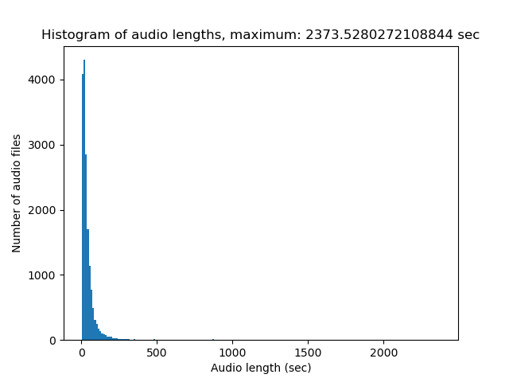
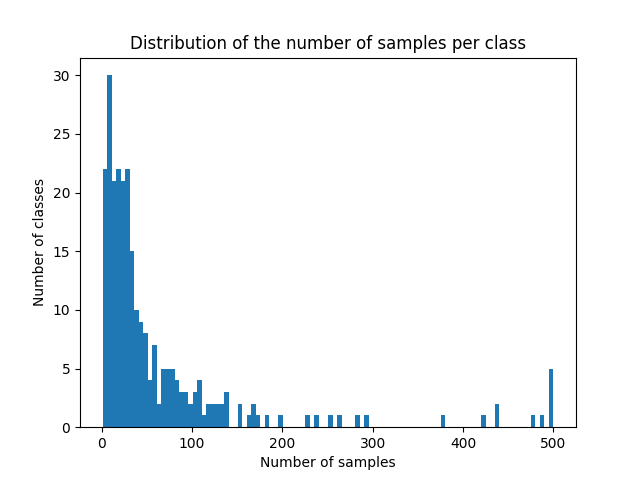

# melyrepules
<pre>
This is a homework for the Deep Learning course at Budapest University of Technology and Economics. 
</pre>

## Participants

* Antal Péter  (ZE4SG8)
* Liska Tamás  (IWGB4I)
* Prohászka Botond Bendegúz  (DG1647)

## Description

Participate in [BirdCLEF](https://www.kaggle.com/competitions/birdclef-2023) and achive as good result as possible.

### The competition  

Birds are excellent indicators of biodiversity change since they are highly mobile and have diverse habitat requirements. Changes in species assemblage and the number of birds can thus indicate the success or failure of a restoration project. However, frequently conducting traditional observer-based bird biodiversity surveys over large areas is expensive and logistically challenging. In comparison, passive acoustic monitoring (PAM) combined with new analytical tools based on machine learning allows conservationists to sample much greater spatial scales with higher temporal resolution and explore the relationship between restoration interventions and biodiversity in depth.

For this competition, you'll use your machine-learning skills to identify Eastern African bird species by sound. Specifically, you'll develop computational solutions to process continuous audio data and recognize the species by their calls. The best entries will be able to train reliable classifiers with limited training data. If successful, you'll help advance ongoing efforts to protect avian biodiversity in Africa, including those led by the Kenyan conservation organization NATURAL STATE.

## Usage

### Training

TODO

### Only predicting

TODO

## Function of the files in the repository

### data_prep/data_preparation.py

We downloaded the datapack from the website of the competiton and integrated into the data preparation docker container.

In data_preparation.py file we implemented a basic data generator class in order to make the dataset available to other containers (e.g. models). The data generator class can resample a wave to a desired rate. We create three instances of the generator class: for the training, validation and test datasets.

### data_prep/mymodel.py

In this file we define a basic neural network model class with an input layer and two dense layers.

### data_prep/traineval.py

The whole learning-evaluation process (from loading the data to the evaluation) is defined in this file.
<br> The following parameters can be used:
* ```-h, or --help```         shows a help message and exit
* ```-s, or --database_size```
                        How big will be the database. All data will be loaded
                        if its value is 0 (default: 100)
                        It is important, that this parameter should be the same value as
                        saved when loading a file
* ```-bs, or --batch_size```
                        Batch size (default: 10)
* ```-if, or --input_filename```
                        If it's not empty, the script will load a file instead
                        of creating a new with transform_df. Do not use file
                        extension! (It's csv) (default: '')
* ```-of, or --output_filename```
                        Output filename of transform_df. Only needed
                        input_filename if is empty. Do not use file extension!
                        (It's csv) (default: 'saved')

### data_prep/Dockerfile

Creates and runs a docker container.

### data_prep/requirements

Describes each library version required in the project.

### .gitignore

Contains the files and librarys we do not intend to upload to github.

## About the data

The data set contains 16941 soundfiles of bird voices. The distribution of the length of th soundfiles are seen on this histogram. 

 

There are 264 different kind of birds. The distribution of the number of samples in the classes are seen below.




## Related works
* The [dataset](https://www.kaggle.com/competitions/birdclef-2023/data)
* [Opening and resampling the waves](https://www.kaggle.com/code/philculliton/inferring-birds-with-kaggle-models)
* For the ```resampling``` function we used [Google Bard](bard.google.com/) 


## How to run

* Install python3 and pip
* Build the docker image
* Run the container

The whole pipeline (data loading, model creation, training and evaluation) is included in the [traineval.py](https://github.com/BotondProhaszka/melyrepules/blob/main/data_prep/traineval.py) file. The docker container runs it.


# Data generator and data preprocessing

This section provides comprehensive documentation for the Bird Voice AI Trainer script, designed for training a deep learning model on bird vocalization data.

## Dependencies

- `pandas` (`pd`)
- `numpy` (`np`)
- `librosa`
- `math`
- `tensorflow` (`tf`)
- `argparse`
- `matplotlib.pyplot` (`plt`)

## Command-line Arguments

The script accepts the following command-line arguments:

- `-h` or `--help`: show the help message and exit
- `-s` or `--database_size`: How big will be the database. All data will be loaded if its value is 0.
- `-bs` or `--batch_size`: Batch size for training.
- `-if` or `--input_filename`: If not empty, the script will load a file instead of creating a new one with `transform_df`. Do not use a file extension (It's csv).
- `-of` or `--output_filename`: Output filename of `transform_df`. Only needed if `input_filename` is empty. Do not use a file extension (It's csv).
- `-mf` or `--model_filename`: Filename of the model to be saved. Do not use a file extension (It's h5).
- `-t` or `--train` or `--no-train`: Training of the model. Evaluation only (it means there is no training) if "--no-train" set (default: True)
- `-e` or `--epochs`: Number of training epochs.
- `-hu` or `--hug` or `--no-hug`: Use the huggingfacce Audio classifies model for training (default: False)

## Global functions

- `get_label_map(df_column)` Function to create a label map based on unique values in a DataFrame column.

    - Parameters:
        - `df_column`: DataFrame column to create the label map from.

    - Returns:
        - `label_dict`: Label map.

- `get_label_map(df_column)` Function to create a label map based on unique values in a DataFrame column.

    - Parameters:
        - `df_column`: DataFrame column to create the label map from.

    - Returns:
        - `label_dict`: Label map.

-  `data_analysis(df)` Function to perform data analysis on the input DataFrame. It calculates the duration of each audio file, generates a histogram of the audio lengths, and saves it as `histogram.png`. It also counts the occurrences of scientific names and saves the counts as a DataFrame in `scientific_names_counts.csv`. The analysis provides insights into the distribution of audio lengths and the frequency of scientific names in the dataset.

    - Parameters:
        - `df`: Input DataFrame.

    - Returns:
        - `df`: Transformed DataFrame.

- `extract_features(audio_path, sr=32000, n_mfcc=13, n_mels=128, n_fft=2048, hop_length=512)` Function to extract certain features from an audio file.

    - Parameters:
        - `audio_path`: Path to the audio file.
        - `sr`: Sampling rate (default is 32000).
        - `n_mfcc`: Number of MFCC coefficients (default is 13).
        - `n_mels`: Number of mel filterbanks (default is 128).
        - `n_fft`: Number of FFT points (default is 2048).
        - `hop_length`: Hop length for feature extraction (default is 512).

    - Returns:
        - `features`: Extracted features for Linear and Logistic Regression.

## `BirdCLEF_DataGenerator(tf.keras.utils.Sequence)`

Class for generating data batches for training a BirdCLEF model. Inherits from `tf.keras.utils.Sequence`.

### Methods:

- `__init__(self, df, label_dict, root_folder, name, batch_size=10, shuffle=True)`: Initializes the data generator.
- `__len__(self)`: Returns the number of batches in the sequence.
- `__getitem__(self, index)`: Generates one batch of data.
- `get_wawe_len(self, filepath)`: Gets the length of the audio file in seconds.
- `transform_df(self, df)`: Transforms the input DataFrame based on command-line arguments.
- `on_epoch_end(self)`: Called at the end of each epoch.
- `open_wawe(self, filepath)`: Opens the audio file and returns the waveform.
- `frame_audio(self, audio_array, window_size_s=5.0, hop_size_s=5.0, sample_rate=32000)`: Helper function for framing audio for inference.
- `resample(self, waveform, desired_sample_rate, original_sample_rate)`: Resamples the waveform to the desired sample rate.
- `ensure_sample_rate(self, waveform, original_sample_rate, desired_sample_rate=32000)`: Ensures the sample rate of the waveform.
- `data_analysis(self, df)`: Performs data analysis on the input DataFrame. It calculates the duration of each audio file, generates a histogram of the audio lengths, and saves it as 'histogram.png'. It also counts the occurrences of scientific names and saves the counts as a DataFrame in 'scientific_names_counts.csv'. The analysis provides insights into the distribution of audio lengths and the frequency of scientific names in the dataset.


## Example Usage

### Instantiate the BirdCLEF_DataGenerator

```python
import tensorflow as tf
from data_preparation import *

df = pd.read_csv('train_metadata.csv')
label_dict = get_label_map(df['scientific_name'])
train_generator = BirdCLEF_DataGenerator(train_df, label_dict, 'data/', batch_size=BATCH_SIZE, name='train')
```
### Data analysis


```python
data_gen.data_analysis(df)
```

## Reference
For the structure of the class we used a [tutorial](https://stanford.edu/~shervine/blog/keras-how-to-generate-data-on-the-fly) by [Shervine Amidi](https://stanford.edu/~shervine/) (data scientist of Stanford University).


# Baseline model

This section provides comprehensive documentation for the Audio Classification Neural Network script, aimed at training a baseline deep learning model on audio data, particularly for bird vocalization classification.

## Dependencies

- `tensorflow (tf)`
- `keras.layers`
- `keras.models.Sequential`

## BaselineModel class

### Methods:

- `__init__(self, BATCH_SIZE, input_shape, num_labels)` Initializes the BaselineModel object.

    - `BATCH_SIZE (int)`: Batch size for training.
    - `input_shape (tuple)`: Input shape of the data.
    - `num_labels (int)`: Number of unique labels for classification.

- `train(self, data, val_data, epochs=100)` Trains the model on the provided training data.

    - `data (tf.keras.utils.Sequence)`: Training data generator.
    - `val_data (tf.keras.utils.Sequence)`: Validation data generator.
    - `epochs (int)` (Optional): Number of training epochs.

     Returns: history: Training history.

- `eval(self, test_data)` Evaluates the model on the provided test data.
    - `test_data (tf.keras.utils.Sequence)`: Test data generator.

- `predict(self, test_data)` Generates predictions on the provided test data.

    - `test_data (tf.keras.utils.Sequence)`: Test data generator.

    Returns: `y_pred (tf.Tensor)`: Predicted labels.

## Example Usage

### Instantiate the BaselineModel

```python
from audio_classification import BaselineModel

model = BaselineModel(BATCH_SIZE, input_shape, num_labels)
```

### Train the Model

```python
history = model.train(train_data, val_data, epochs=10)
```
### Evaluate the Model

```python
model.eval(test_data)
```
### Make Predictions

```python
predictions = model.predict(test_data)
```

# LSTM Model

This section provides comprehensive documentation for the LSTM Audio Classification Model script, aimed at training a deep learning model on audio data using Long Short-Term Memory (LSTM) architecture.

## Dependencies

- `tensorflow` (`tf`)
- `tf.keras`
- `keras.layers`
- `keras.models`
- `keras.models.Sequential`
- `numpy` (`np`)
- `sklearn.metrics.average_precision_score`

## Global functions

- `padded_cmap_tensorflow(y_true, y_pred, padding_factor=5)`

A custom TensorFlow function to calculate the mean average precision score with padding.

    - Parameters:
        - `y_true`: True labels.
        - `y_pred`: Predicted labels.
        - `padding_factor` (optional): Padding factor for arrays (default is 5).

    - Returns:
        - `result_tensor`: Resulting tensor with the mean average precision score.

## LSTMModel class

#### Methods:

- `__init__(self, num_labels, input_shape, loss='mean_squared_error', optimizer='adam', metrics=['accuracy']), class_weights=None)`

    Initializes the `LSTMModel` object.

    Parameters:

    - `num_labels`: Number of unique labels for classification.
    - `input_shape`: Shape of the input data.
    - `loss` (optional): Loss function for model training (default is 'mean_squared_error').
    - `optimizer` (optional): Optimizer for model training (default is 'adam').
    - `metrics` (optional): Evaluation metrics for model training (default is 'accuracy').
    - `class_weights` (optional): Class weights for imbalanced data (default is None).

- `train(self, data, val_data, epochs=100, checkpoint_filepath='saved_model/1', batch_size=30, verbose=1)`

    Trains the model on the provided training data.

    Parameters:

    - `data`: Training data generator.
    - `val_data`: Validation data generator.
    - `epochs` (optional): Number of training epochs (default is 100).
    - `checkpoint_filepath` (optional): Path to save model checkpoints (default is 'saved_model/1').
    - `class_weights` (optional): Class weights for imbalanced data (default is None).
    - `batch_size` (optional): Batch size for training (default is 30).
    - `verbose` (optional): Verbosity mode (default is 1).

    Returns:
    - `history`: Training history.

- `predict(self, test_data)`

    Generates predictions on the provided test data.

    Parameters:
    - `test_data`: Test data generator.

    Returns:
    - `y_pred`: Predicted labels.

- `evaluate(self, test_data)`

    Evaluates the model on the provided test data.

    Parameters:
    - `test_data`: Test data generator.

- `save(self, path)`

    Saves the model at the specified path.

    Parameters:
    - `path`: Path to save the model.

- `load(self, path)`

    Loads a pre-trained model from the specified path.

    Parameters:
    - `path`: Path to the saved model.

## References
To use `class_weights` we used a [tutorial](https://www.tensorflow.org/tutorials/structured_data/imbalanced_data#class_weights) by the original documentation of [TensorFlow](https://www.tensorflow.org/).


# Training and Evaluation 

This section provides documentation for the BirdCLEF Audio Classification script, aimed at training a deep learning model on audio data, particularly for bird vocalization classification.

## Dependencies

- `data_preparation`
- `lstm_model`
- `pandas (pd)`
- `sklearn.model_selection.train_test_split`
- `matplotlib.pyplot (plt)`
- `sklearn.metrics.accuracy_score`
- `sklearn.metrics.precision_score`
- `sklearn.metrics.recall_score`
- `sklearn.metrics.f1_score`
- `sklearn.metrics.confusion_matrix`
- `sklearn.metrics.average_precision_score`
- `numpy (np)`
- `tensorflow (tf)`

## Global functions

- `padded_cmap(y_true, y_pred, padding_factor=5)` Evaluation function of the first placed team's [solution](https://github.com/VSydorskyy/BirdCLEF_2023_1st_place/blob/main/code_base/utils/metrics.py) of the BirdCLEF competition. It calculates the average precision score with macro averaging and label padding.

    - Parameters:
        - `y_true (tf.Tensor)`: True labels.
        - `y_pred (tf.Tensor)`: Predicted labels.
        - `padding_factor (int)` (Optional): Padding factor for label padding.

    - Returns:
        - `padded_cmap (float)`: Average precision score with macro averaging and label padding.


## Functionality

### 1. Data Preparation
   - Loads metadata from 'train_metadata.csv'.
   - Optionally limits the dataset size with the `-s` or `--database_size` command-line argument.
   - Splits the dataset into training, validation, and test sets.
   - Creates data generators for each set.
   - Calculating a class_weights dictionary to handle unbalanced samples

### 2. Model Architecture
   - Implements one of three model architectures: `BaselineModel`, `LSTMModel`, and `HuggingModel`.
   - The `LSTMModel` class defines the LSTM model architecture for audio classification.

### 3. Training
   - Initializes the chosen model with the specified parameters.
   - Trains the model using the training set and validates on the validation set.
   - Displays training accuracy over epochs.

### 4. Evaluation
   - Computes various evaluation metrics on the test set:
      - Accuracy
      - Precision
      - Recall
      - F1 Score
      - Custom metric: `padded_cmap` (average precision score with macro averaging and label padding)

