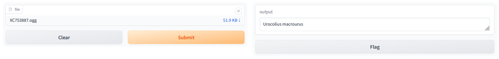

# melyrepules
<pre>
This is a homework for the Deep Learning course at Budapest University of Technology and Economics. 
</pre>

## Participants

* Antal Péter  (ZE4SG8)
* Liska Tamás  (IWGB4I)
* Prohászka Botond Bendegúz  (DG1647)

## Description

Participate in [BirdCLEF](https://www.kaggle.com/competitions/birdclef-2023) and achive as good result as possible.

### The competition  

Birds are excellent indicators of biodiversity change since they are highly mobile and have diverse habitat requirements. Changes in species assemblage and the number of birds can thus indicate the success or failure of a restoration project. However, frequently conducting traditional observer-based bird biodiversity surveys over large areas is expensive and logistically challenging. In comparison, passive acoustic monitoring (PAM) combined with new analytical tools based on machine learning allows conservationists to sample much greater spatial scales with higher temporal resolution and explore the relationship between restoration interventions and biodiversity in depth.

For this competition, you'll use your machine-learning skills to identify Eastern African bird species by sound. Specifically, you'll develop computational solutions to process continuous audio data and recognize the species by their calls. The best entries will be able to train reliable classifiers with limited training data. If successful, you'll help advance ongoing efforts to protect avian biodiversity in Africa, including those led by the Kenyan conservation organization NATURAL STATE.

## Usage

### Training and eavluating

The whole pipeline (data loading, model creation, training and evaluation) is included in the [traineval.py](https://github.com/BotondProhaszka/melyrepules/blob/main/data_prep/traineval.py) file. The docker container runs it.


For training you need to run the data_prep docker container.
```bash
cd path/to/melyrepules/birdclef
docker build -t traineval -f data_prep/Dockerfile .
docker run -it -rm traineval
```

If you want to train the model with other parameters you can modify the Dockerfile.

```Dockerfile
CMD ["python", "traineval.py", "-s", "500", "-bs", "50", "-of", "500"]
```

### Only predicting and demo

To use the modell to predict or demo you need to run the demo docker container.
```bash
cd path/to/melyrepules/demo
docker build -t demo -f demo/Dockerfile .
docker run -it -rm demo
```

After the docker container is running you can open 7860 port in your browser and you can see the demo.

The UI of the demo is seen below.




## Function of the files in the repository

### data_prep/data_preparation.py

We downloaded the datapack from the website of the competiton and integrated into the data preparation docker container.

In data_preparation.py file we implemented a basic data generator class in order to make the dataset available to other containers (e.g. models). The data generator class can resample a wave to a desired rate. We create three instances of the generator class: for the training, validation and test datasets.

### data_prep/mymodel.py

In this file we define a basic neural network model class with an input layer and two dense layers.

### data_prep/traineval.py

The whole learning-evaluation process (from loading the data to the evaluation) is defined in this file.
<br> The following parameters can be used:
* ```-h, or --help```         shows a help message and exit
* ```-s, or --database_size```
                        How big will be the database. All data will be loaded
                        if its value is 0 (default: 100)
                        It is important, that this parameter should be the same value as
                        saved when loading a file
* ```-bs, or --batch_size```
                        Batch size (default: 10)
* ```-if, or --input_filename```
                        If it's not empty, the script will load a file instead
                        of creating a new with transform_df. Do not use file
                        extension! (It's csv) (default: '')
* ```-of, or --output_filename```
                        Output filename of transform_df. Only needed
                        input_filename if is empty. Do not use file extension!
                        (It's csv) (default: 'saved')

### data_prep/Dockerfile

Creates and runs a docker container.

### data_prep/requirements

Describes each library version required in the project.

### .gitignore

Contains the files and librarys we do not intend to upload to github.

## About the data

The data set contains 16941 soundfiles of bird voices. The distribution of the length of th soundfiles are seen on this histogram. 

 

There are 264 different kind of birds. The distribution of the number of samples in the classes are seen below.


## Related works
* The [dataset](https://www.kaggle.com/competitions/birdclef-2023/data)
* [Opening and resampling the waves](https://www.kaggle.com/code/philculliton/inferring-birds-with-kaggle-models)
* For the ```resampling``` function we used [Google Bard](bard.google.com/) 

